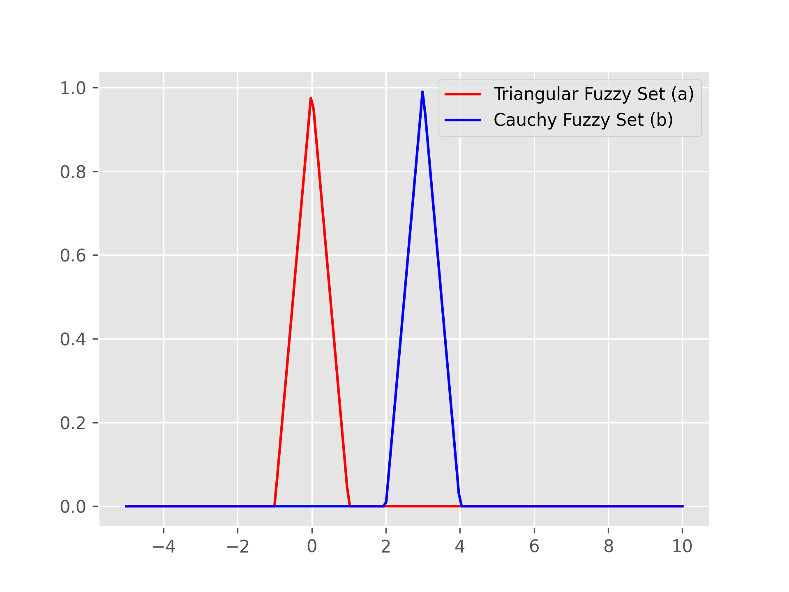
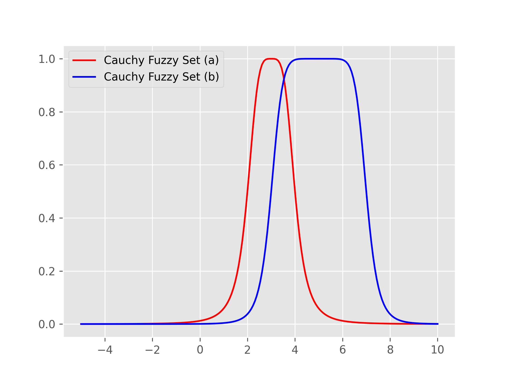

# Table of Contents
 * [Triangular fuzzy numbers](#triangular-fuzzy-numbers)
 * [Fuzzy sets](#fuzzy-sets)
 * [Plotting](#plotting)

**To-Do**
- implementar Cauchyset [Done]
  1. Try with many codes []
  2. create a code with example at README []
- implementar tnorma( DeMorgan tripdrástica, produto e soma probabilista, min max ) obs: qualquer definição de uma tnorma -> automaticamente no t-conorma [Done]
  1. Verify the Tnorm product
  2. Create code example of Tnorm product
  3. Verify the Tconorm probabilistic sum
  4. Create code example of probabilistic sum
  5. verify the Tnorm min max
  6. Create code with Tnorm min and Tconorm max
- implementar takagi-sugeno, mandanam
  -> dados de saída são em dataframe com todas as variáveis 


# fuzzysets
**fuzzysets** is a simple Python package that is well suited for interactive experiments with fundamental concepts in fuzzy set theory.  

# Installation
The package is available on [PYPI](https://pypi.org/project/fuzzysets/) and can be installed with pip:  
```pip install fuzzysets```  
```pip install git+https://github.com/thigs0/fuzzysets.git```  
# Notation
In the following sections, code snippets will be highlighted like this.  

```python
import fuzzysets as fs
```

Examples involving a read-evaluate-print loop will show both the Python statement, which will be preceded by a `>>>` prompt, and its output, if any.  

<a name="triangular-fuzzy-numbers"></a>
## Triangular fuzzy numbers
One of the concepts implemented by **fuzzysets** is a triangular fuzzy number (TFN), represented with the *TriangularFuzzyNumber* class.  

Each TFN can be uniquely represented as a 3-tuple of real numbers (left, peak, right) (l, n and r below) where:

 - peak is the number whose membership degree is 1, that is, the number being modeled
 - left (< peak) and right (> peak) determine the fuzzy number's membership function:
    - mu(x) = 0, x ∈ (-inf, l) U (r, +inf)
    - mu(x) = (x - l) / (n - l), l <= x <= n
    - mu(x) = (r - x) / (r - n), n <= x <= r

The TriangularFuzzyNumber class offers a more complex abstraction than that.  

We first need to import the **fuzzysets** package:  

```python
>>> import fuzzysets as fs
```

The class is available through an alias - TFN. The default value of the class is 0:  

```python
import matplotlib.pyplot as plt
import numpy as np
from tfn import TriangularFuzzyNumber as tfn

plt.style.use('ggplot')
a = tfn()
b = tfn(3,2,4)
plt.plot(x, a.mu(x), label="Triangular Fuzzy Set (a)", color="red")
plt.plot(x, b.mu(x), label="Cauchy Fuzzy Set (b)", color="blue")
x = np.linspace(-5,10,200)
```


```python
>>> fs.TFN()
TriangularFuzzyNumber(l=-1.0, n=0.0, r=1.0)
```

As you can see, the *left* and *right* properties are offset by 1 by default. We could create a TFN that models any number like this:  

```python
>>> fs.TFN(11.5)
TriangularFuzzyNumber(l=10.5, n=11.5, r=12.5)
```

It is also possible to set one or both of the other properties:  

```python
>>> fs.TFN(10, r=12.8)
TriangularFuzzyNumber(l=9.0, n=10.0, r=12.8)
>>> fs.TFN(10.6, 8, 12)
TriangularFuzzyNumber(l=8.0, n=10.6, r=12.0)
```

We can also obtain the alpha cut of a TFN:  

```python
>>> n
TriangularFuzzyNumber(l=1.0, n=2.0, r=4.0)
>>> n.alpha_cut
AlphaCut(1.0 + alpha * 1.0, 4.0 + alpha * -2.0)
```

It can be converted to a more user-friendly string than the one above and can compute the interval for a fixed alpha:  

```python
>>> cut = n.alpha_cut
>>> str(cut)
'[1.0 + alpha * 1.0, 4.0 + alpha * -2.0]'
>>> cut.for_alpha(0.5)
(1.5, 3.0)
```


## Cauchy fuzzy Set

```python
import matplotlib.pyplot as plt
import numpy as np
import CauchyFuzzyNumber as cfn

a = cfs(1,2,3)
b = cfs(2,4,5)

x = np.linspace(-5,10,200)
plt.plot(x, a.mu(x))
plt.style.use('ggplot')
plt.plot(x, a.mu(x), label="Cauchy Fuzzy Set (a)", color="red")
plt.plot(x, b.mu(x), label="Cauchy Fuzzy Set (b)", color="blue")
```



## Mandani inference method

**Example**

```python
import numpy as np
from typing import Callable, List, Tuple
from cauchyfuzzyset import CauchyFuzzySet
from tfn import TriangularFuzzyNumber
from tnorm import Tnorm, AND
from inference import MamdaniInference

#heavy of cloths
ml = TriangularFuzzyNumber(0, -20, 20)
l = TriangularFuzzyNumber(30,10, 50)
p = TriangularFuzzyNumber(65, 40, 90)
mp = TriangularFuzzyNumber(90, 75,100)

#dirt cloths
ql = TriangularFuzzyNumber(0, -20, 20)
s = TriangularFuzzyNumber(30, 10, 50)
ms = TriangularFuzzyNumber(70, 40, 100)
es = TriangularFuzzyNumber(100, 80, 120)

# Define regras com funções anônimas ou conjuntos fuzzy
muito_pouco = TriangularFuzzyNumber(10, 0, 20)
pouco = TriangularFuzzyNumber(30, 20, 40)
moderado = TriangularFuzzyNumber(50, 40 ,60)
exagerado = TriangularFuzzyNumber(70, 60 ,80)
maximo = TriangularFuzzyNumber(100, 80 ,120)

#tnorm
p1,p2 = 10,15
ps = [p1, p2]
w1 = AND([ml, ql])
w2 = AND([ml, s])
w3 = AND([ml, ms])
w4 = AND([ml, es])

w5 = AND([l, ql])
w6 = AND([l, s])
w7 = AND([l, ms])
w8 = AND([l, es])

w9  = AND([p, ql])
w10 = AND([p, s])
w11 = AND([p, ms])
w12 = AND([p, es])

w13 = AND([mp, ql])
w14 = AND([mp, s])
w15 = AND([mp, ms])
w16 = AND([mp, es])

# Sistema de inferência
mi = MamdaniInference()
mi.add_rule(antecedent = w1, consequent = muito_pouco)
mi.add_rule(antecedent = w2, consequent = pouco)
mi.add_rule(antecedent = w3, consequent = moderado)
mi.add_rule(antecedent = w4, consequent = moderado)
mi.add_rule(antecedent = w5, consequent = pouco)
mi.add_rule(antecedent = w6, consequent = pouco)
mi.add_rule(antecedent = w7, consequent = moderado)
mi.add_rule(antecedent = w8, consequent = exagerado)
mi.add_rule(antecedent = w9, consequent = moderado)
mi.add_rule(antecedent = w10, consequent = moderado)
mi.add_rule(antecedent = w11, consequent = exagerado)
mi.add_rule(antecedent = w12, consequent = exagerado)
mi.add_rule(antecedent = w13, consequent = moderado)
mi.add_rule(antecedent = w14, consequent = exagerado)
mi.add_rule(antecedent = w15, consequent = maximo)
mi.add_rule(antecedent = w16, consequent = maximo)

# Inferência
saida = mi.infer(ps, np.linspace(0, 100, 1000))
print("Saída defuzzificada:", saida)
```

<a name="fuzzy-sets"></a>
